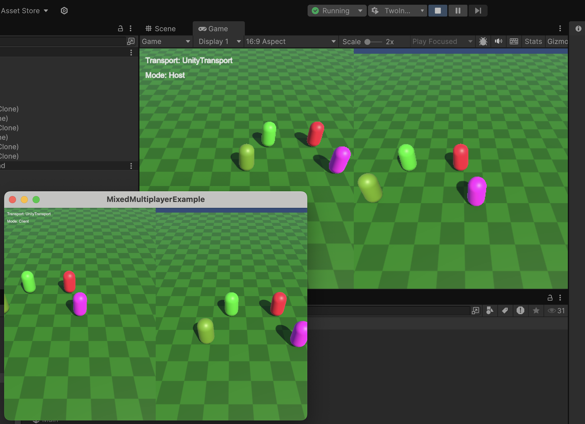

# MixedMultiplayerExample

**MixedMultiplayerExample** is a Unity project showcasing how to implement both **local** and **online multiplayer**. It serves as a template for building games where players on the same device can play alongside remote players.



## Features

- **Mixed Multiplayer Support:** Combines local and online players in the same game session, demonstrating basic implementation for mixed multiplayer.
  - **Local Multiplayer:** Uses Unity's PlayerInputManager to manage multiple players on the same device with split-screen gameplay. Supports input from both controllers and keyboards.
  - **Online Multiplayer:** Uses Unity's Netcode for GameObjects with a server-client model to handle remote players.
  - **Input Handling:** Handles multiple input devices, supporting both local and remote players using Unity's Input System.

## Requirements and Packages

- Unity **6** (Tested with Unity 6000.0.28f).
- Packages installed with Unity Package Manager:
  - **Cinemachine** (`com.unity.cinemachine`): Camera control system for dynamic gameplay.
  - **Input System** (`com.unity.inputsystem`): Advanced input handling for multiple devices.
  - **Multiplayer Playmode** (`com.unity.multiplayer.playmode`): Tools for testing multiplayer in play mode.
  - **Multiplayer Tools** (`com.unity.multiplayer.tools`): Tools for monitoring and debugging multiplayer performance.
  - **Netcode for GameObjects** (`com.unity.netcode.gameobjects`): Networking solution for managing multiplayer game state.

## Getting Started

1. **Clone the Repository**
   ```bash
   git clone git@github.com:juhenius/MixedMultiplayerExample.git
   ```
2. **Open in Unity**: Use Unity 6.
3. **Install Dependencies**: Use **Package Manager** to install required packages.
4. **Play Example Scene**: Open `_project/Main` and press **Play**.
   
   (Optional: To test multiplayer locally, use Multiplayer Playmode with the 'TwoInstances' option to launch multiple processes.)

## How It Works

- **Player Join Action**: When a player triggers the Join action using a controller or keyboard, an instance of `LocalPlayer` is created. `LocalPlayer` contains the `PlayerInput` component related to `PlayerInputManager`.
- **NetworkPlayer Creation**: An RPC (Remote Procedure Call) is then sent to request the server to spawn an instance of `NetworkPlayer`. Note that `LocalPlayer` only exists in the client where the player is, while `NetworkPlayer` is replicated to each client.
- **Linking Players**: The `LocalPlayer` and `NetworkPlayer` are linked, which is triggered by the server sending an RPC back to the original client, informing it about the new player's network object ID, ensuring the correct controller or input device is mapped to the appropriate player.
- **PlayerInputManager**: This component is used to handle split-screen functionality, allowing multiple players on the same device to play together.
- **Cinemachine Setup**: Each player-camera combination needs a unique output channel, which is configured using Cinemachine to avoid conflicts and provide a smooth gameplay experience.

## Resources

- [Netcode for GameObjects](https://docs-multiplayer.unity3d.com/netcode/current/about/)
- [Client-server quickstart](https://docs-multiplayer.unity3d.com/netcode/current/tutorials/get-started-ngo/)
- [Local Multiplayer and Split-Screen - New Input and Cinemachine](https://www.youtube.com/watch?v=l9HrraxtdGY)
- [2 players per device in a game](https://estebangamedev.hashnode.dev/unitymultiplayer-connecting-2-players-per-device)

## License

Licensed under the [MIT License](LICENSE).
